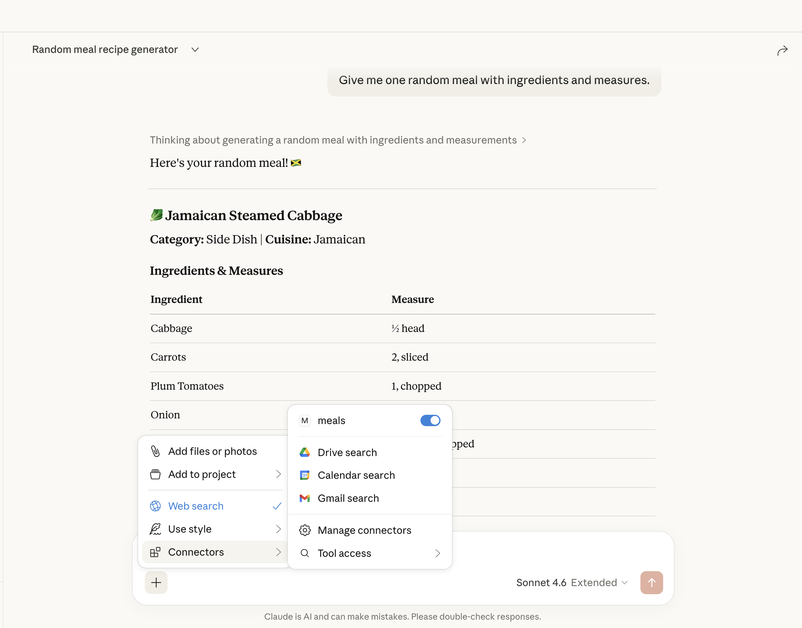
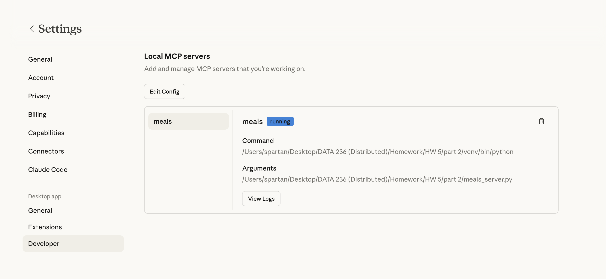
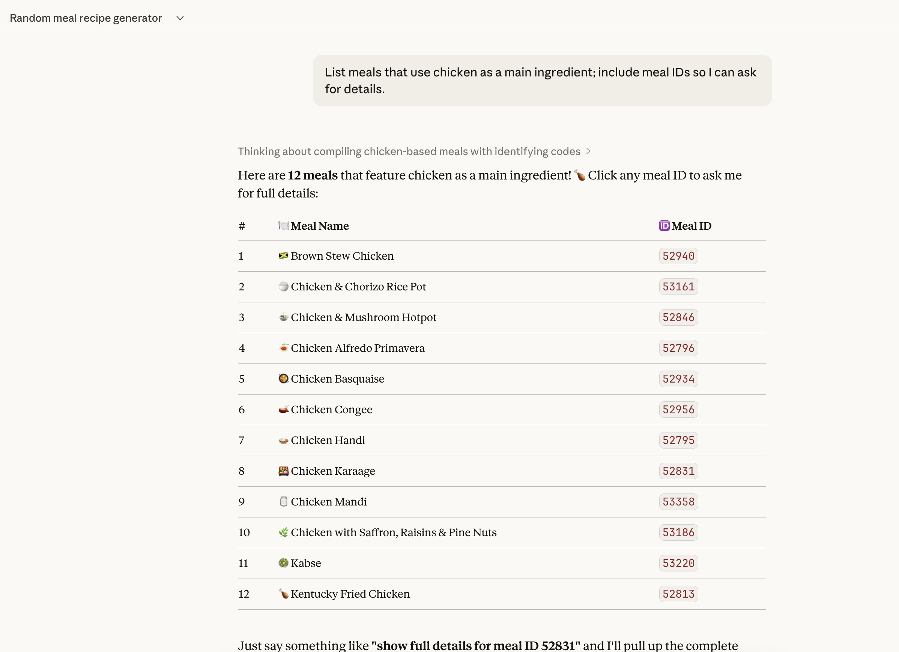
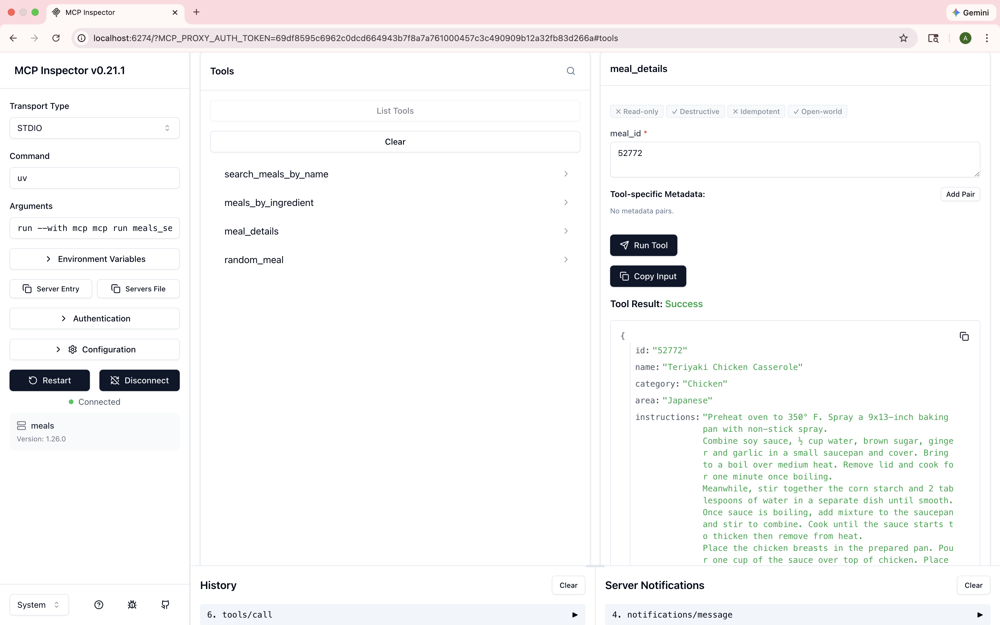

# 🍽️ meals-mcp-server

A Model Context Protocol (MCP) server that connects **Claude AI** to a live meals database. Ask Claude anything about meals — search by name, ingredient, or ID, or get a random meal suggestion — all through natural language.

---

## 📁 Project Structure

```
meals-mcp-server/
│
├── meals_server.py        # MCP server — all tools defined here
├── requirements.txt       # Python dependencies
├── README.md
└── screenshots/
    ├── mcp_server.png
    ├── claude_connect.png
    ├── meal_by_name.png
    ├── meal_by_ingredient.png
    ├── meal_by_id.png
    └── random_meal.png
```

---

## ⚙️ Setup & Installation

### 1. Clone the repo

```bash
git clone https://github.com/YOUR-USERNAME/meals-mcp-server.git
cd meals-mcp-server
```

### 2. Create a virtual environment

```bash
python -m venv venv
source venv/bin/activate        # Mac/Linux
venv\Scripts\activate           # Windows
```

### 3. Install dependencies

```bash
pip install -r requirements.txt
```

### 4. Run the server

```bash
python meals_server.py
```

---

## 🔌 Connect to Claude Desktop

1. Open **Claude Desktop → Settings → Developer**
2. Click **Edit Config** to open `claude_desktop_config.json`
3. Add the following (replace the path with your actual path):

```json
{
  "mcpServers": {
    "meals": {
      "command": "python",
      "args": ["/absolute/path/to/meals-mcp-server/meals_server.py"]
    }
  }
}
```

4. **Restart Claude Desktop**
5. The meals tools will appear in Claude's tool panel ✅

---

## 🧰 Available Tools

| Tool | Description |
|------|-------------|
| `meal_by_name` | Search for meals by name |
| `meal_by_ingredient` | Find meals containing a specific ingredient |
| `meal_by_id` | Get full details of a meal by its ID |
| `random_meal` | Fetch a random meal suggestion |

---

## 📸 Screenshots

### ✅ Claude Connected to Meals Server


### 🖥️ MCP Server Running in Claude


### 🔍 Search Meals by Name


### 🥦 Search by Ingredient


### 📋 Meal Details by ID


### 🎲 Random Meal


---

## 📦 Dependencies

```
mcp
httpx
```

---

## 🛠️ Built With

- [MCP (Model Context Protocol)](https://modelcontextprotocol.io) — Claude tool integration
- [TheMealDB API](https://www.themealdb.com/api.php) — Meals data source
- Python + httpx

---

*Built by Anushka Rajesh Khadatkar*
